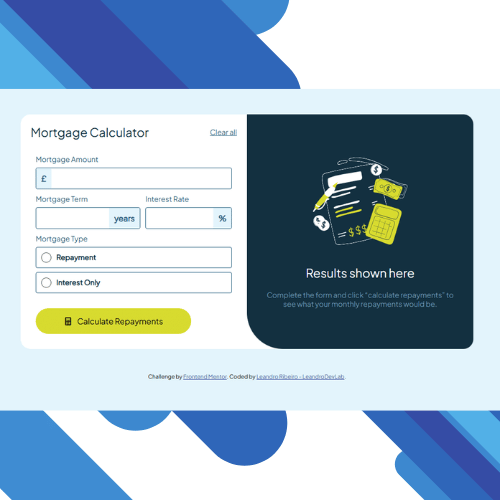
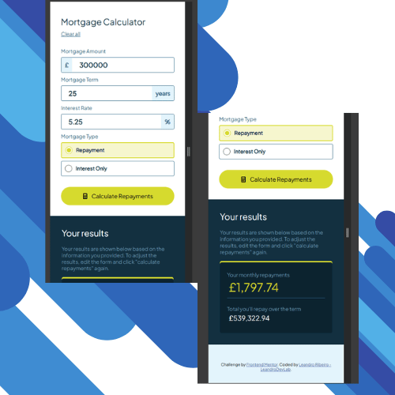

# Frontend Mentor - Mortgage repayment calculator solution

This is a solution to the [Mortgage repayment calculator challenge on Frontend Mentor](https://www.frontendmentor.io/challenges/mortgage-repayment-calculator-Galx1LXK73). Frontend Mentor challenges help you improve your coding skills by building realistic projects.

## Table of contents

- [Overview](#overview)
  - [The challenge](#the-challenge)
  - [Screenshot](#screenshot)
  - [Links](#links)
- [My process](#my-process)
  - [Built with](#built-with)
  - [What I learned](#what-i-learned)
  - [Continued development](#continued-development)
  - [Useful resources](#useful-resources)
- [Author](#author)
- [Acknowledgments](#acknowledgments)

**Note: Delete this note and update the table of contents based on what sections you keep.**

## Overview

### The challenge

Users should be able to:

- Input mortgage information and see monthly repayment and total repayment amounts after submitting the form
- See form validation messages if any field is incomplete
- Complete the form only using their keyboard
- View the optimal layout for the interface depending on their device's screen size
- See hover and focus states for all interactive elements on the page

### Screenshot


<p float="left">
  
  
</p>

### Links

- Solution URL: [Add solution URL here](https://your-solution-url.com)
- Live Site URL: [Add live site URL here](https://your-live-site-url.com)

## My process

### Built with

- Semantic HTML5 markup
- CSS custom properties
- Flexbox
- CSS Grid
- Media query

### What I learned

During development, I learned about:

- Form manipulation with JavaScript.
- How to use JS classes to organize code.
- Working with responsive layout using CSS Grid and Flexbox.
- Improving form accessibility (keyboard usage).
- Using events with preventDefault and event listeners.
- How to format currency with `Intl.NumberFormat`.

To see how you can add code snippets, see below:

```html
<!--I reviewed the radio input and label-->
<input id="repayment" type="radio" name="escolha" value="R" />
<label for="repayment">Repayment</label>
```

```css
/* Register a new font */
@font-face {
  font-family: 'Plus Jakarta Sans';
  src: url('../fonts/PlusJakartaSans-VariableFont_wght.ttf') format('truetype');
  font-weight: normal;
  font-style: normal;
}
```

```js
//Currency output
valorFormatado(valor) {
    const valorFormatado = new Intl.NumberFormat('en-GB', {
      style: 'currency',
      currency: 'GBP',
    }).format(valor);
```

```js
// Select input checked and value
const radioChecked = document.querySelector('input[name="escolha"]:checked');
const radioValue = radioChecked.value;

if (radioValue === 'R') {
  console.log(radioValue);
}
```

```js
//Return focus to an input or button after submitting
this.clearButton.focus();
```

If you want more help with writing markdown, we'd recommend checking out [The Markdown Guide](https://www.markdownguide.org/) to learn more.

### Continued development

In future projects, I want to continue focusing on improving the following areas:

- **JavaScript Classes and OOP (Object-Oriented Programming):**  
  This project was my first experience transforming multiple functions into a single class with properties and methods. I want to continue practicing this pattern and applying it to larger projects.

- **Form Validation and Accessibility (A11y):**  
  I learned how to implement basic form validation and improve keyboard navigation using the `tabindex` and focus management, but I want to study more advanced accessibility techniques.

- **Responsive Layouts with CSS Grid and Flexbox:**  
  Although I managed to apply Grid and Flexbox layouts, I want to become more confident when combining both techniques for complex responsive designs.

- **Internationalization and Currency Formatting:**  
  This was my first time using the `Intl.NumberFormat` API for currency formatting. I want to explore more about internationalization (i18n) and number/date localization.

---

### Useful resources

- [MDN Web Docs - Intl.NumberFormat](https://developer.mozilla.org/en-US/docs/Web/JavaScript/Reference/Global_Objects/Intl/NumberFormat)  
  This documentation helped me understand how to format numbers as currency for different locales like GBP, USD, and BRL.

- [MDN Web Docs - @font-face](https://developer.mozilla.org/en-US/docs/Web/CSS/@font-face)  
  Helped me understand how to load local fonts in CSS for use in this project.

- [CSS-Tricks - A Complete Guide to Grid](https://css-tricks.com/snippets/css/complete-guide-grid/)  
  Very helpful for understanding CSS Grid layout techniques.

## Author

- Website - [Leandro Oliota-Ribeiro](https://leandrodevlab.github.io/)
- Frontend Mentor - [@LeandroDevLab](https://www.frontendmentor.io/profile/LeandroDevLab)
- LinkedIn - [Leandro Oliota-Ribeiro](www.linkedin.com/in/leandrosoribeiro)

## Acknowledgments

I thank God for the passion I have for coding, if I have this passion it is because He allowed it to be planted and grow inside me. I am also grateful to my family for their support and patience, as I spend some (many) hours dedicated to the computer and studying. I thank Frontend Mentor for creating and making challenges like these available.
